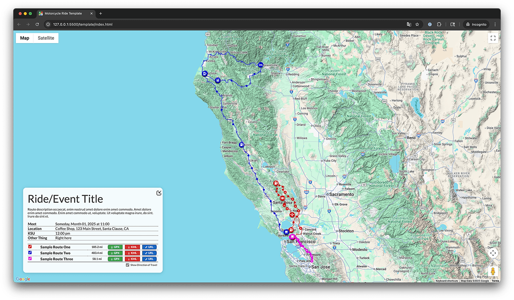
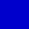
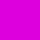
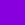

# Moto-Rooter

Behold, a flexible framework for visualizing and sharing motorcycle routes. Just drop a new `.kml` file into the `/data/` directory and make sure its name is registered in `routes.json`. Your map will update accordingly—new routes will be displayed, route lengths and distance from start/fuel stops are automagically calculated, and GPX/URL buttons added or removed as needed.

This is a _static_ site—it does not rely on any server-side language or database—just HTML, CSS, and a bit of vanilla JS. When you're ready to deploy, all you need is a barebones web server (e.g. Apache, Nginx) sans database. It’s designed to be simple and easy to deploy, maintain, and scale as needed. For example, the [live demo](https://moto-rooter.feralcreative.dev/template/) linked below is hosted on a Synology NAS in my dining room. 🥳



[](https://moto-rooter.feralcreative.dev/template/)

---

## 🚦 Quick Start

1. **Plan and Export Your Route**

   - Use any route planning tool—[MyRoute-app](https://www.myrouteapp.com/), [Google My Maps](https://mymaps.google.com/), [Garmin BaseCamp](https://www.garmin.com/en-US/software/basecamp/), etc.
   - Export your route as a `.kml` file (**required**), and optionally as `.gpx` (for sharing and/or loading to a navigation app or device) and `.url` (for links to the original route in your mapping app).

2. **Project Structure**

   - **`/template/`**: Base files for new ride route pages.
     - `index.html`: Main HTML file (uses Bootstrap, loads Google Maps, references `/js/main.js` and `/css/main.min.css`).
   - **`data/`**: Route-specific data files.
     - `.kml`, `.gpx`, `.url`: GPS tracks and route links for each segment (e.g., `01-Sample-Route-One.kml`).
     - `routes.json`: List of route base names (e.g., `{ "base": "01-Sample-Route-One" }`).
     - `build.sh`: Helper script to auto-generate `routes.json`.

3. **File Roles & Data Management**

- **KML:** Generates the map (required).
- **GPX:** For easy download, sharing, and use in most navigation apps and devices.
- **URL:** Adds a button linking to the original route for editing or repurposing.
  > NOTE: _A `.url` file in this context is simply a plain text file containing only a URL in ASCII format, with no extra formatting, metadata, or encoding—just the URL itself on a single line._
- **`routes.json`**: List of route base names (e.g., `{ "base": "01-Sample-Route-One" }`).
- **`build.sh`**: Helper script to auto-generate `routes.json`.

## 🏍️ Customizing Logos

Logo images for the demo and route pages live in the local `./img/logos/` directory (not `/img` at the project root). There are two main logos used in the UI:

- **`panel-logo.png`** — appears to the left of the title in the info panel.
- **`map-logo.png`** — appears at the top right of the map.

Both are referenced with relative paths like `./img/logos/map-logo.png` and can be customized by swapping out the image files or updating the HTML/CSS as needed.

By default, both logo images are wrapped in anchor tags (links) in the HTML. You can change or remove these links as desired to point to your own site, a club page, or nowhere at all.

- **To remove a logo:** Just delete or rename the relevant PNG in `./img/logos/`. The code will automatically hide the placeholder if the image is missing—no further action required.
- **To use your own logo:** Replace any placeholder PNG with your own image (using the same filename for instant results, or update the HTML if you use a different name).
- **No server restart needed:** Logo changes appear as soon as you reload the page.

_This makes it easy to brand your map pages with your club, group, or event logo—or remove logos entirely for a minimalist look._

---

## Local Development & Environment

### API Key Setup

You can provide your Google Maps API key in one of two ways:

#### 1. Direct HTML approach (no Node required)

If you don't want to use Node/npm at all, you can add your API key directly to the HTML files. In `demo/index.html`, comment out the Node.js block and uncomment the direct API block, replacing `YOUR_API_KEY_HERE` with your actual API key:

```html
<!-- <script>
      window.GOOGLE_MAPS_API_KEY = "{{ GOOGLE_MAPS_API_KEY }}";
    </script>
    <script async defer src="https://maps.googleapis.com/maps/api/js?key={{ GOOGLE_MAPS_API_KEY }}&v=beta&libraries=maps,geometry&callback=initMap">
    </script> -->

<script
  async
  defer
  src="https://maps.googleapis.com/maps/api/js?key=YOUR_API_KEY_HERE&v=beta&libraries=maps,geometry&callback=initMap"></script>
```

#### 2. Node/dotenv approach: Use the Express server with [dotenv](https://www.npmjs.com/package/dotenv) to inject your API key from a `.env` file. This is the recommended method for development and keeps your API key secure.

Create a `.env` file in the project root with your Google Maps API key:

```env
GOOGLE_MAPS_API_KEY=your-key-here
PORT=6686  # Optional, defaults to 6686
```

- The server will automatically inject this key into any HTML files it serves.
- HTML files contain placeholder tags: `{{ GOOGLE_MAPS_API_KEY }}` that get replaced at runtime.

##### Install dependencies:

```sh
npm install
```

##### Set up environment variables:

- Create a `.env` file in the project root with your Google Maps API key:

```env
GOOGLE_MAPS_API_KEY=your-key-here
PORT=6686  # Optional, defaults to 6686
```

##### Start the server:

- For production:

      ```sh
      npm start
      ```

- For development (with live reload, see below):

      ```sh
      npm run dev
      ```

  - The Express server runs on port 6686 by default, configurable in the .env file.

---

## Map Features & Logic

### Features:

- Initializes Google Map and configures appearance.
- Loads/parses `.kml` route files, displays ride paths as colored polylines.
- Calculates route mileage (Google Maps Geometry API).
- Generates route legend and download buttons for each route.
- Manages interactive features (route highlighting, marker display).
- Reads from `data/routes.json` to determine which routes to display.

### Main Components:

- **`initMap()`**: Entry point, sets up map, loads KML routes, builds UI.
- **`loadKmlRoute()`**: Fetches/parses KML, draws polyline, computes mileage.
- **`addRouteDownloadButtons()`**: Builds download table, sets up UI interactions.
- **`updateRouteLegend()`**: Updates color-coded route legend.
- **Helpers:**
  - `getWaypointTitle(role)`, `getColoredSvgIcon(iconPath, color, opacity)`, `setRouteHighlight(activeIndex)`, `hexToRgba(hex, alpha)`

### Data Flow:

- Loads available routes from `data/routes.json`.
- For each `.kml`, loads and draws on the map.
- Creates download buttons for GPX/KML if available.
- Interactive features are generated based on loaded data.

4. **Important Notes**:

- **`initMap()`**: Entry point, sets up map, loads KML routes, builds UI.
- **`loadKmlRoute()`**: Fetches/parses KML, draws polyline, computes mileage.
- **`addRouteDownloadButtons()`**: Builds download table, sets up UI interactions.
- **`updateRouteLegend()`**: Updates color-coded route legend.

---

## Customization & Advanced Topics

Replace `your-google-maps-api-key-here` with your actual API key.

If you share this project, share instructions for setting up the `.env` file but do **not** share your actual API key.

### Customization

- To add new routes, update `routes.json` and add the corresponding `.kml`/`.gpx` files.
- Colors and UI styling can be changed in the script or via CSS.
- The script is modular, so you can extend or override helper functions for custom marker icons, legends, or interactivity.

---

## Waypoint Types and Custom Icons

### Standard Waypoints

Each waypoint on the map can be assigned a type, which determines the icon used to represent it. Custom icons are chosen by prepending keywords to the waypoint name as described below. Non-named waypoints are styled with a dot, depending on if they were added manually by the user or automatically by the mapping app.

#### Standard Waypoint Types

| Type      | Icon                                                                                            | Notes                                                                                                                                                                                                                  |
| --------- | ----------------------------------------------------------------------------------------------- | ---------------------------------------------------------------------------------------------------------------------------------------------------------------------------------------------------------------------- |
| Manual    |   | Waypoints defined by you manually, a human (ostensibly) in your mapping app of choice                                                                                                                                  |
| Automatic |  | Waypoints added automatically (e.g. using the <a href="https://support.myrouteapp.com/en/support/solutions/articles/12000102514-manual-toolkits-#Expand" target="_blank" rel="noopener">Expand</a> tool in MyRouteApp) |

---

### Custom Waypoints

Each waypoint can have up to four custom icons each. To display the correct icon(s) for a waypoint, **name the waypoint in your mapping software with a prefix in this format:**

```
TYPE - Waypoint Name
```

Where `TYPE` is one of the supported types below (e.g., `GAS - Chevron Station`). To add additional types to a single waypoint, delimit the terms with a `/` like:

```
GAS/BREAK/LUNCH - Waypoint Name
```

#### Custom Waypoint Types

| Group                    | Type    | Icon                                                                           | File Location               | Alternate Accepted Words            |
| ------------------------ | ------- | ------------------------------------------------------------------------------ | --------------------------- | ----------------------------------- |
| **Logistical**           | START   |      | /img/icons/icon-start.svg   | BEGIN                               |
| &rdsh;                   | FINISH  |    | /img/icons/icon-finish.svg  | END                                 |
| &rdsh;                   | HOME    |        | /img/icons/icon-home.svg    | HOUSE                               |
| &rdsh;                   | MEET    |        | /img/icons/icon-meet.svg    | MEETUP, JOIN, MEETING, CONVERGE     |
| &rdsh;                   | SPLIT   |      | /img/icons/icon-split.svg   | DEPART, DIVERGE, LEAVE              |
| **Journey Essentials**   | GAS     |          | /img/icons/icon-gas.svg     | FUEL                                |
| &rdsh;                   | CHARGE  |    | /img/icons/icon-charge.svg  | CHARGER                             |
| &rdsh;                   | BREAK   |      | /img/icons/icon-break.svg   | REST                                |
| **Amenities & Comfort**  | CAMP    |        | /img/icons/icon-camp.svg    | CAMPGROUND, CAMPING                 |
| &rdsh;                   | HOTEL   |      | /img/icons/icon-hotel.svg   | LODGING, MOTEL, AIRBNB, SLEEP, STAY |
| &rdsh;                   | FOOD    |        | /img/icons/icon-food.svg    | LUNCH, DINNER, BREAKFAST            |
| &rdsh;                   | COFFEE  |    | /img/icons/icon-coffee.svg  | CAFE                                |
| &rdsh;                   | DRINKS  |    | /img/icons/icon-drinks.svg  | BAR, COCKTAILS, BEER, BEERS         |
| &rdsh;                   | GROCERY |  | /img/icons/icon-grocery.svg | GROCERIES                           |
| **Interesting & Scenic** | VIEW    |        | /img/icons/icon-view.svg    | SCENIC, LOOKOUT, VIEWPOINT          |
| &rdsh;                   | POI     |          | /img/icons/icon-poi.svg     | STOP                                |
| &rdsh;                   | WTF     |          | /img/icons/icon-wtf.svg     | WEIRD, RANDOM                       |

The icons in this project were designed in Figma, and can be accessed and forked by copying [this Figma doc](https://www.figma.com/design/pFQck3CUIa5twKqMu1IxD5/moto-router?node-id=66-2&t=0WKGatLYE2TZ02Gb-1).

**Note:** To allow the icons to change color with the route lines, manually edit your SVG code to change the fill value from `black` to `currentColor`.

## Route Coloring

Each route polyline is assigned a color from a predefined list in `main.js`.

### How to Customize Route Colors

1. Open `js/main.js` and search for `const colors = [` to locate the color palette.
2. Edit the hex color values in the array to your preference. You can add, remove, or rearrange colors as needed.
3. The script will automatically apply these colors to routes, cycling through the list if there are more routes than colors.

This makes it easy to control the visual identity of your maps and ensure each route is clearly distinguishable.

### Default Color Palette

| Order | Hex Code  | Label      | Swatch                                         |
| ----- | --------- | ---------- | ---------------------------------------------- |
| 1     | `#cc0000` | Red        |               |
| 2     | `#0000cc` | Blue       |             |
| 3     | `#DD00DD` | Magenta    |       |
| 4     | `#4A148C` | Purple     |         |
| 5     | `#00aaaa` | Cyan       |             |
| 6     | `#FF6F00` | Orange     |         |
| 7     | `#4E342E` | Brown      |           |
| 8     | `#006064` | Teal       |             |
| 9     | `#0D1335` | Dark Blue  |    |
| 10    | `#A0740B` | Mustard    |       |
| 11    | `#003300` | Dark Green |  |
| 12    | `#550000` | Burgundy   |     |
| 13    | `#8800DD` | Violet     |         |

---

## Development Roadmap

### Harebrained ideas:

| Done | Description                                                                                                                                                                                       | Added      | Completed  | By                                                 |
| ---- | ------------------------------------------------------------------------------------------------------------------------------------------------------------------------------------------------- | ---------- | ---------- | -------------------------------------------------- |
| ☑️   | Augment the look of non-custom waypoints and/or polylines to indicate intended direction of travel along a given route (e.g. chevrons instead of dots, or perhaps polylines with pointed dashes). | 2024.07.05 | 2025.07.11 | [@feralcreative](https://github.com/feralcreative) |
| ⬜   | Add mailto links to email route files (kml, gpx, etc.) rather than just downloading                                                                                                               | 2025.07.09 |            |                                                    |
| ⬜   | Social sharing and/or embed code generation might be nice too                                                                                                                                     | 2025.07.10 |            |                                                    |
| ⬜   | Enable the ability to easily add a logo or banner of your club, riding group, etc.                                                                                                                | 2025.07.10 |            |                                                    |
| ⬜   | Alternately, a lightweight banner with top nav to allow wayfinding for a trips with multiple map pages.                                                                                           | 2025.07.10 |            |                                                    |
