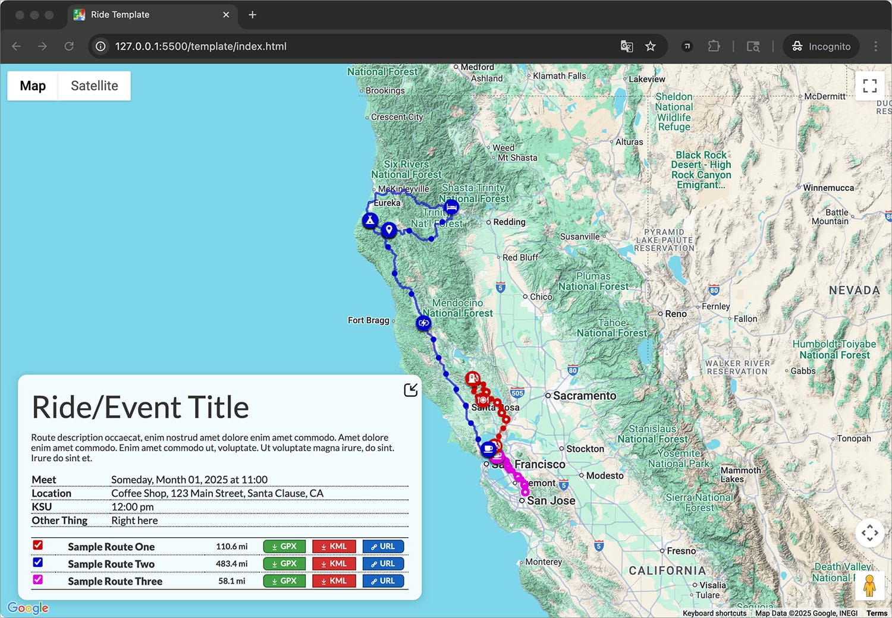

# Motorcycle Ride Template

A flexible web template for visualizing and sharing motorcycle routes online.



---

## 🚦 Quick Start

1. **Plan and Export Your Route**

   - Use any route planning tool—[MyRoute-app](https://www.myrouteapp.com/), [Google My Maps](https://mymaps.google.com/), [Garmin BaseCamp](https://www.garmin.com/en-US/software/basecamp/), etc.
   - Export your route as a `.kml` file (**required**), and optionally as `.gpx` (for downloads) and `.url` (for original route links).

2. **Project Structure**

   - **`/template/`**: Base files for new ride route pages.
     - `index.html`: Main HTML file (uses Bootstrap, loads Google Maps, references `/js/main.js` and `/css/main.min.css`).
   - **`data/`**: Route-specific data files.
     - `.kml`, `.gpx`, `.url`: GPS tracks and route links for each segment (e.g., `01-Sample-Route-One.kml`).
     - `routes.json`: List of route base names (e.g., `{ "base": "01-Sample-Route-One" }`).
     - `build.sh`: Helper script to auto-generate `routes.json`.

3. **File Roles & Data Management**

- **KML:** Generates the map (required).
- **GPX:** For download only.
- **URL:** Adds a button linking to the original route for editing or repurposing.
- **`routes.json`**: List of route base names (e.g., `{ "base": "01-Sample-Route-One" }`).
- **`build.sh`**: Helper script to auto-generate `routes.json`.

---

---

## Local Development & Environment

1. **Install dependencies:**
   ```sh
   npm install
   ```
2. **Set up environment variables:**
   - Create a `.env` file in the project root with your Google Maps API key:
     ```env
     GOOGLE_MAPS_API_KEY=your-key-here
     ```
3. **Start the server:**
   - For production:
     ```sh
     npm start
     ```
   - For development (with live reload, see below):
     ```sh
     npm run dev
     ```
   - The Express server runs on port 3000 by default.

---

## Map Features & Logic

### Features:

- Initializes Google Map and configures appearance.
- Loads/parses `.kml` route files, displays ride paths as colored polylines.
- Calculates route mileage (Google Maps Geometry API).
- Generates route legend and download buttons for each route.
- Manages interactive features (route highlighting, marker display).
- Reads from `data/routes.json` to determine which routes to display.

### Main Components:

- **`initMap()`**: Entry point, sets up map, loads KML routes, builds UI.
- **`loadKmlRoute()`**: Fetches/parses KML, draws polyline, computes mileage.
- **`addRouteDownloadButtons()`**: Builds download table, sets up UI interactions.
- **`updateRouteLegend()`**: Updates color-coded route legend.
- **Helpers:**
  - `getWaypointTitle(role)`, `getColoredSvgIcon(iconPath, color, opacity)`, `setRouteHighlight(activeIndex)`, `hexToRgba(hex, alpha)`

### Data Flow:

- Loads available routes from `data/routes.json`.
- For each `.kml`, loads and draws on the map.
- Creates download buttons for GPX/KML if available.
- Interactive features are generated based on loaded data.

4. **Important Notes**:

- **`initMap()`**: Entry point, sets up map, loads KML routes, builds UI.
- **`loadKmlRoute()`**: Fetches/parses KML, draws polyline, computes mileage.
- **`addRouteDownloadButtons()`**: Builds download table, sets up UI interactions.
- **`updateRouteLegend()`**: Updates color-coded route legend.

---

## Customization & Advanced Topics

Replace `your-google-maps-api-key-here` with your actual API key.

If you share this project, share instructions for setting up the `.env` file but do **not** share your actual API key.

### Customization

- To add new routes, update `routes.json` and add the corresponding `.kml`/`.gpx` files.
- Colors and UI styling can be changed in the script or via CSS.
- The script is modular, so you can extend or override helper functions for custom marker icons, legends, or interactivity.

---

## Waypoint Types, Icons, and Route Colors

### Waypoint Types and Icons

Each waypoint on the map can be assigned a type, which determines the icon used to represent it. The mapping is defined in the script as follows:

---

**IMPORTANT: How to Trigger Waypoint Icons**

To display the correct icon for a waypoint, **name the waypoint in your mapping software with a prefix in this format:**

```
TYPE - Waypoint Name
```

Where `TYPE` is one of the supported types above (e.g., `GAS - Chevron Station`).
This ensures the correct icon is displayed for each waypoint on the map.

---

| Type    | Icon                                                                           | File Location               | Alternate Accepted Words            |
| ------- | ------------------------------------------------------------------------------ | --------------------------- | ----------------------------------- |
| MEET    |        | /img/icons/icon-meet.svg    | MEETUP, JOIN, MEETING, CONVERGE     |
| SPLIT   |       | /img/icons/icon-split.svg   | DEPART, DIVERGE, LEAVE              |
| CAMP    |        | /img/icons/icon-camp.svg    | CAMPGROUND, CAMPING                 |
| GAS     |          | /img/icons/icon-gas.svg     | FUEL                                |
| CHARGE  |    | /img/icons/icon-charge.svg  | CHARGER                             |
| FOOD    |        | /img/icons/icon-food.svg    | LUNCH, DINNER, BREAKFAST            |
| HOTEL   |      | /img/icons/icon-hotel.svg   | LODGING, MOTEL, AIRBNB, SLEEP, STAY |
| DRINKS  |    | /img/icons/icon-drinks.svg  | BAR, COCKTAILS, BEER, BEERS         |
| COFFEE  |    | /img/icons/icon-coffee.svg  | CAFE                                |
| GROCERY |  | /img/icons/icon-grocery.svg | GROCERIES                           |
| POI     |          | /img/icons/icon-poi.svg     | STOP                                |
| VIEW    |        | /img/icons/icon-view.svg    | SCENIC, LOOKOUT, VIEWPOINT          |
| START   |      | /img/icons/icon-start.svg   | BEGIN                               |
| FINISH  |    | /img/icons/icon-finish.svg  | END                                 |
| HOME    |        | /img/icons/icon-home.svg    | HOUSE                               |
| BREAK   |      | /img/icons/icon-break.svg   | REST                                |

### Route Colors

Each route polyline is assigned a color from a predefined list in the script. Colors are cycled for multiple routes.

#### How to Customize Route Colors

1. Open `js/main.js` and search for `const colors = [` to locate the color palette.
2. Edit the hex color values in the array to your preference. You can add, remove, or rearrange colors as needed.
3. The script will automatically apply these colors to routes, cycling through the list if there are more routes than colors.

This makes it easy to control the visual identity of your maps and ensure each route is clearly distinguishable.

**Current Color Palette (as defined in the script):**

| Order | Hex Code  | Label      | Swatch                                         |
| ----- | --------- | ---------- | ---------------------------------------------- |
| 1     | `#cc0000` | Red        |               |
| 2     | `#0000cc` | Blue       |             |
| 3     | `#DD00DD` | Magenta    |       |
| 4     | `#4A148C` | Purple     |         |
| 5     | `#00aaaa` | Cyan       |             |
| 6     | `#FF6F00` | Orange     |         |
| 7     | `#4E342E` | Brown      |           |
| 8     | `#006064` | Teal       |             |
| 9     | `#0D1335` | Dark Blue  |    |
| 10    | `#A0740B` | Mustard    |       |
| 11    | `#003300` | Dark Green |  |
| 12    | `#550000` | Burgundy   |     |
| 13    | `#8800DD` | Violet     |         |

This is the actual palette used for route polylines. You can update or expand it as needed for your project.
